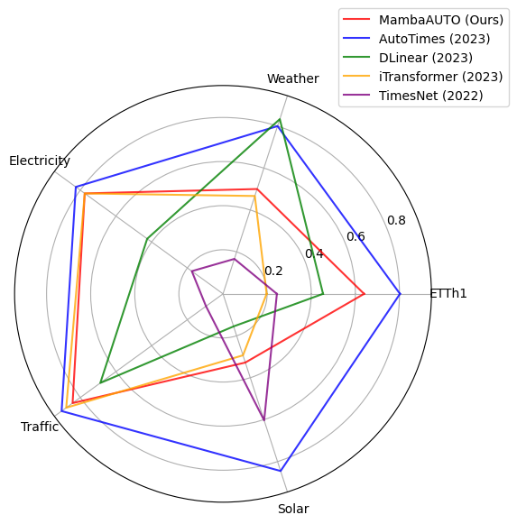

<div align="center">
  <!-- <h1><b> Time-LLM </b></h1> -->
  <!-- <h2><b> Time-LLM </b></h2> -->
  <h2><b> MambaAUTO: Time Series Forecasting Using Mamba as Backbone </b></h2>
</div>

### 1. Introduction
We proposed a novel framework leveraging newly published Pretrained Language Model, Mamba, to solve time series forecasting tasks.  
The input time series will first pass the instance norm layer, and then be divided into patches
for easier local information capture. A multimodal block will then be in charge of encoding them into
embeddings that can align the inputs better with the LLM inputs. The embeddings will then be fed into
the backbone for encoding and feature extraction. The output will then pass a linear layer to match the
output window size.


### 2. Performance
MambaAUTO outperformed most popular time-series models in recent years, except for AutoTimes, which is currently the State-of-the-art.


### To install all dependencies:
```
pip install -r requirements.txt
```

### To download the datasets:  
You can access the well pre-processed datasets from [[Google Drive]](https://drive.google.com/file/d/1NF7VEefXCmXuWNbnNe858WvQAkJ_7wuP/view?usp=sharing), then place the downloaded contents under `./dataset`

### To train the model and run testings, you can use the following commands as examples, in which weather can be replaced with other datasets, such as electricity, traffic, etc.:
```
python3 train.py --model="Mamba-130m" --data="custom" --root_path="./dataset/weather/" --data_path="weather.csv" --test_pred_len=96 --d_k=96 --nhead=8 --batch_size=64
```
The resulting MSE and MAE loss will be saved in the result_long_term_forecast.txt.